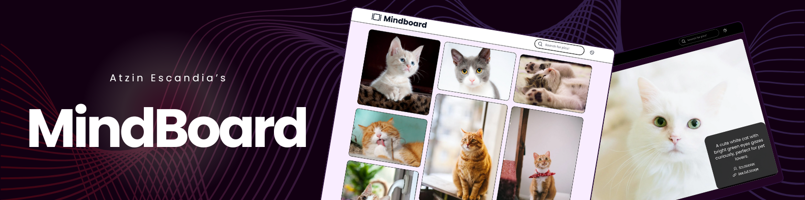

# 📸 Mindboard

<div align="center">
  <a href="https://theplumup.com" target="_blank">
    
  </a>

  <p>A smooth, responsive, and virtualized photo gallery built with React + TypeScript.</p>

  <div>
    
    
    
    
  </div>
</div>

---

## 🧠 About the Project

Mindboard is a cool Single Page App made for speed and a great user experience. It features a **custom virtualized masonry grid** (no outside layout libraries here!), a **photo detail view with metadata**, and **live search**.

---

## ✨ Features

-   🔲 **Virtualized Masonry Grid**

    -   Built totally from scratch, no third-party layout magic.
    -   Only renders photos you can actually see, so it’s super fast.

-   🔍 **Search Functionality**

    -   Search photos by keywords.
    -   Results show up in the same cool grid, still virtualized.

-   🖼 **Photo Details View**

    -   Click a photo to see it bigger with title, description, and photographer info (date wasn’t available in the API).
    -   Hit back and you’ll jump right back to where you left off in the gallery.

-   🎨 **Theme feature**

    -   Toggle between light and dark modes for your vibe.

---

## 🔧 Technologies

-   **React** + **React Router DOM**
-   **TypeScript**
-   **Vite** (because fast is life)
-   **TanStack Query** (handling API state like a pro)
-   **Tailwind CSS**
-   **Axios** for fetching photos

---

## 🚀 Getting Started

### 1. Clone the repo

```bash
git clone https://github.com/atzin-escandia/mindboard
cd mindboard
```

### 2. Install dependencies

```bash
yarn install
```

### 3. Set up environment variables

Create a `.env` file at the root with:

```env
VITE_PEXELS_API_KEY=your_pexels_api_key_here
VITE_API_URL=https://api.pexels.com/v1
```

Grab your API key from [Pexels](https://www.pexels.com/api/).

### 4. Run the app in dev mode

```bash
yarn dev
```

### 5. Build for production

```bash
yarn build
```

### 6. Preview production build

```bash
yarn preview
```

---

## 📚 Resources

-   [Pexels API Docs](https://www.pexels.com/api/documentation/)
-   [React Docs](https://react.dev/)
-   [TanStack Query Docs](https://tanstack.com/query/latest)
-   [Tailwind Docs](https://tailwindcss.com/docs)

---

## 🧑‍💻 Made with ❤️ by [Atzin](https://theplumup.com/)
